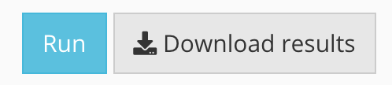

**The deconv_ensemble app allow users to perform ensemble deconvolution as well as other deconvolution methods.**

- *Analyze* your data in the "Analysis" tab.

# Instructions

Code can be found on github: 

Please post [issues on github](https://github.com/randel/EnsDeconv), and feel free to contribute by forking and submitting development branches.

To run this app locally on your machine, download R or RStudio and run the following commands once to set up the environment:

To get detailed description of how to choose input, click:

## Input Data 

You may use this app by

1. Upload your own bulk data that is either
    i. RNA-seq data 
    ii. Microarray data

### Bulk Data and Reference Format 

- Can be a .CSV *comma-separated-value* file (you may export from Excel), .rds, and .RData file
- File must have a header row.
- First/Left-hand column(s) must be gene identifiers.

#### Count or Expression Data

- Each row denotes a gene, each column denotes a sample.

Count data contains read counts for each gene for each sample, along with gene identifiers.

Analysis: When raw counts are uploaded, the data is then analyzed by the app. The app allow user to choose data transformation and data scaling approaches. 

## Output 
You will view boxplots for each deconvolution methods, and each boxplot is titled as "DeconvolutionMethods_MarkerGeneSelection_Scale_Normalization". For our ensemble methods, we simply use "Ensemble" as title.

You can also download estimated cell type fractions by clicking “Download Results”:

Example file: https://github.com/randel/EnsDeconv

