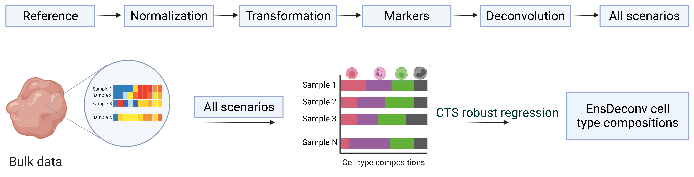

**Cell Type Deconvolution **

Cell type fractions have been shown useful in many genomics analyses. Traditional methods for determining cell-type fractions like immunohistochemistry and flow cytometry remain costly compared to computational approaches using bulk RNA-seq data. Many computational methods, which are called cell type deconvolution, have been proposed to infer cell-type fractions from bulk transcriptomics data. However, these methods produce very different results under different settings. 

We introduce EnsDeconv (Ensemble Deconvolution), which uses ensemble learning to to robustly estimate cellular fractions from bulk omics data.

---

